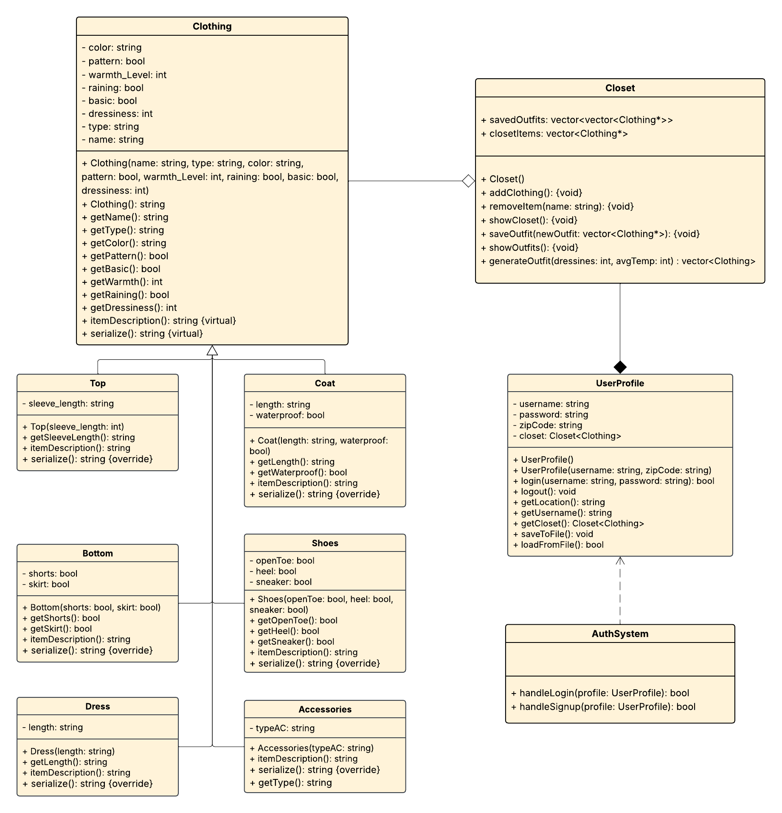

# CMSC 240 Final Project - Forecast Fits
Author(s): Alicia Lavender, Milijana Stojanovic, Sydney Reis 

Project Purpose & Description: Choosing an outfit every day that is appropriate for the weather and where you are going that day can be time-consuming and irritating. Our program provides a solution to this situation by generating outfits for users based on the clothing in their closet, the weather, and the type of occasion they are going to attend.

## Installation Instructions for the Emscription Library 
To use the ForecastFits program you'll need to have access to the Emscription Library. If you don't have it installed type the following commands into your terminal:

```git clone https://github.com/emscripten-core/emsdk.git```

```cd emsdk```

```./emsdk install latest```

```./emsdk activate latest```

```source ./emsdk_env.sh```

## Compiling & Running the Program
Compiling and running the text based version of ForecastFits:
1. Type the following into your terminal:
```make```
2. Type the following into your terminal:
```./ForecastFits```
3. Start building your closet!

Compiling and running the HTML version of ForecastFits:
1. Type the following into your terminal:
    ```python3 -m http.server 8081```
2. When the pop-up window appears select "Open in browser."
3. Select ForecastFits.html
4. Start building your closet! 

## UML Diagram


## Example Usage
(https://drive.google.com/file/d/1Rr54SM9UGLGlJVh3PEhH-3jNpN0K44XG/view?usp=sharing)

## AI Usage Links
- [Help with debugging text based version](https://chatgpt.com/share/69cff7b2-f2ec-8327-bf8b-5e266d535c92)
- [Converting program to WASM](https://claude.ai/share/ba9d5c7a-7ab5-4245-9580-65497343ce14)
- [Saving Outfits to txt file](https://chatgpt.com/c/69dd5e3b-ea68-8325-a213-a3b57d486e60)
- [Saving items from vector to txt file + Help for authentication when logging in](https://chatgpt.com/share/69f00119-a980-83ea-a2c1-80e232b1a4e8)
